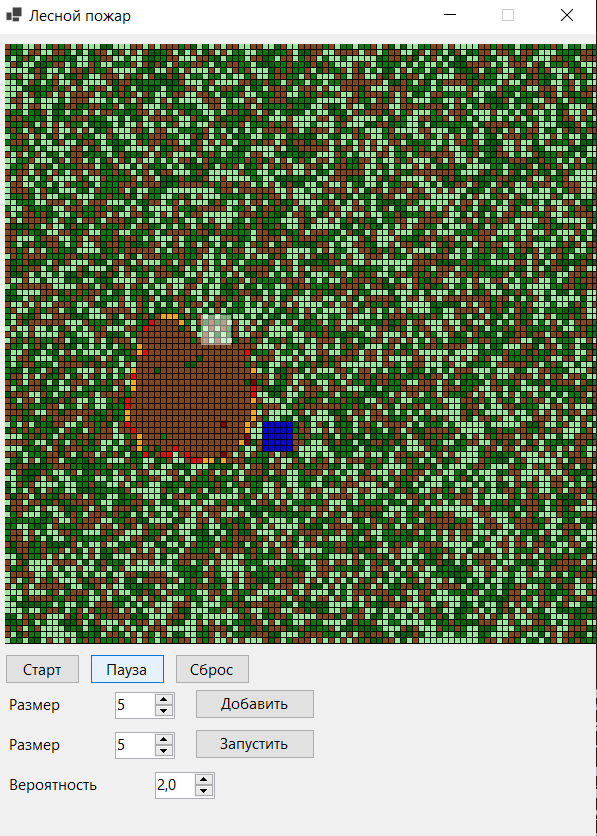

### Клеточные автоматы. 

**Задание:**  
Реализовать моделирование возникновения и распространения лесных пожаров с использованием двумерного клеточного автомата.

**Основное поле**\
 (EMPTY) – пустая земля (сгоревшая).\
 (GRASS) – трава (светло-зеленый).\
 (SHRUB) – кустарник (зеленый).\
 (TREE) – большое дерево (темно-зеленый).\
 (FIRE_GRASS) – горящая трава (оранжевый).\
 (FIRE_SHRUB) – горящий куст (красный).\
 (FIRE_TREE) – горящее дерево (темно-красный).\
 (WATER) – вода (синий).

 **Правила распространения**\
Для осмотра соседей используется окрестность Мура (север, юг, запад, восток, северо-запад, северо-восток, юго-восток, юго-запад). 

Если клетка горит , она становится пустой.\
Если клетка содержит растительность , проверяются ее соседи в окружении:
- среди горящих соседей определяется максимальный «фактор силы» (sourceFactor): трава – 1.0, куст – 1.2, дерево – 1.8.
-  вероятность загорания = базовая вероятность * максимальный фактор.
-  базовая вероятность: трава – 1.0, куст – 0.7, дерево – 0.4.

 **Водоемы**\
Кнопка «Добавить водоём» активирует режим размещения. Пользователь выбирает размер водоема  в поле NumericUpDown.\
Вода не горит и не распространяет огонь (и не зарастает растительностью).

 **Облачко**\
 Облако появляется в случайном месте поля.Его размер задается пользователем.\
 (полупрозрачно отображается белым прямоугольником поверх клеток).

 Эффект облака: на каждом шаге все клетки, пересекающиеся с облаком (даже частично), если они горят , превращаются в пустую землю.

 **Регенерация раститльности**

 На каждом шаге после распространения огня и действия облака возобновляется рост выживших растений:
 -вероятность регенерации задается в процентах (0–100%).
 
 Для каждой пустой клетки (EMPTY) подсчитываются соседние клетки с растительностью.\
 Каждому типу растительности присвоен «вес» (трава – 1, куст – 2, дерево – 3).

 Суммарный вес всех соседей определяет общий шанс появления растения.

 **Результат работы**
 

