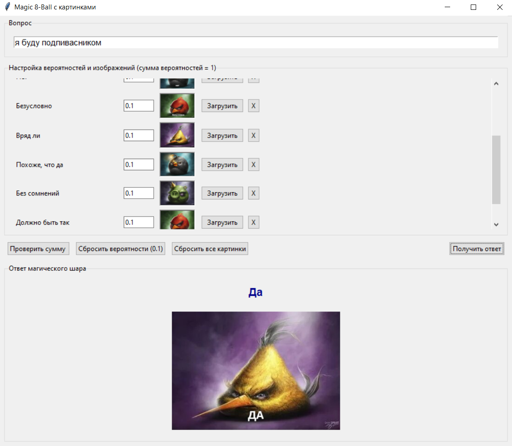

### Моделирование случайных событий (GUI)

**Часть 1:**  
Приложение «Скажи “да” или “нет”».

**Часть 2:**  
Приложение «Шар предсказаний» (Magic 8-Ball).

**Решение**
Программы реализованы в python с использованиеам tkinter.

**Приложение да / нет**\
Пользователь может задать вопрос  и получить на него случайный ответ.Генератор случайных чисел MRNG (Мультипликативный конгруэнтный метод)\

seed = (β * seed) mod M,  где β = 2³²+3, M = 2⁶³.(В общем и целом реализация такая же как в лабораторной №4)

Логика ответа такая: Генерируется случайное число r, если r < 0.5 → ответ «НЕТ», иначе → «ДА».\
Вероятность каждого ответа — ровно 50%.

При нажатии кнопки или Enter срабатывает get_answer(), который и выводит заготовленный ответ.\
После ответа поле ввода очищается после каждого нажатия.

**Приложение «Шар предсказаний»**\
Пользователь может задать вопрос и получить ответ из конечного множества заготовленных ответов:
["Да", "Абсолютно точно", "Не могу сказать", "Нет", "Безусловно", "Вряд ли", "Похоже, что да", "Без сомнений", "Должно быть так",  "Мало шансов"]

Варианты ответа равновероятны изначально, но их можно менять.

Выбор: генерируется случайная величина (при помощи генератора из лабораторной работы 4) и далее определяется, какому варианту ответа эта величина соответствует.\
Определение варианта ответа производится при помощи  суммы: вероятности вариантов ответа суммируются до тех пор, пока не превзойдут занчение случайной величины. Вариант ответа,на котором это суммирование остановилось, является результатом.

**Результат**\

