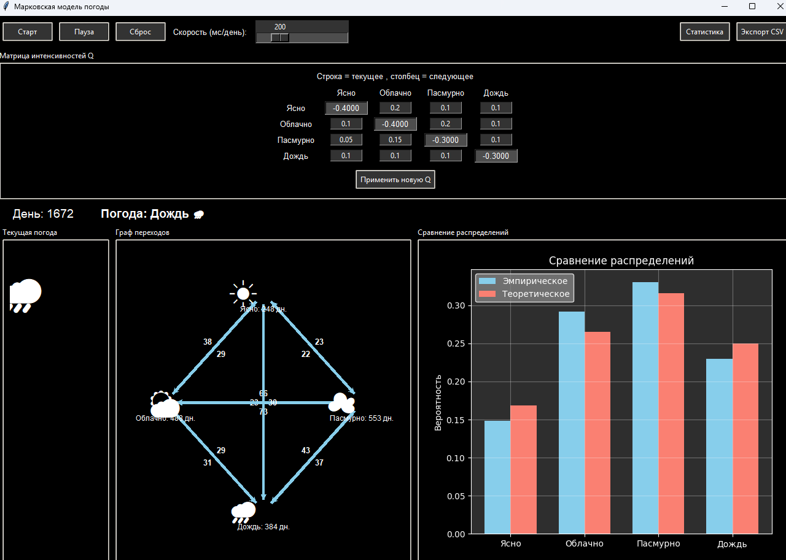
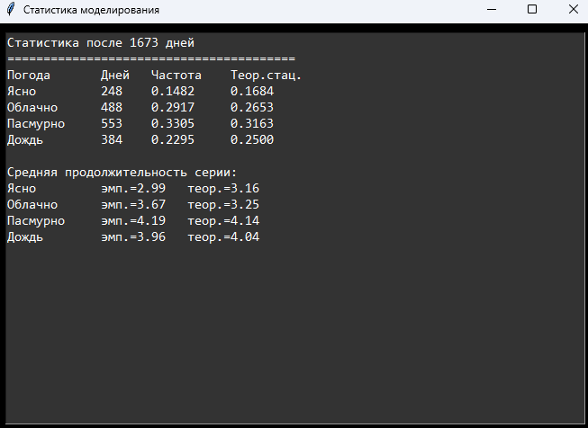

# Отчёт по лабораторной работе

## Марковская модель погоды

### 1. Цель работы
Изучить принципы построения и анализа дискретных цепей Маркова. Реализовать программное приложение для имитационного моделирования динамики состояний погоды с графическим интерфейсом для:
1. Моделирования переходов между тремя состояниями (ясно, облачно, пасмурно) на основе матрицы переходных вероятностей.
2. Визуализации процесса в реальном времени.
3. Расчета теоретического стационарного распределения и сравнения его с эмпирическими данными.
4. Сбора и хранения статистики в формате `.csv`.

---

### 2. Описание приложения

#### 2.1. Модуль настройки и управления
Приложение позволяет пользователю интерактивно задавать вероятности переходов в виде матрицы $4 \times 4$. Реализована проверка условия нормировки. Также предусмотрен регулятор скорости генерации для визуального анализа процесса на разных временных масштабах.

#### 2.2. Система визуализации и логирования
- **Информационная панель:** отображает текущий день и текущее состояние системы с использованием графических символов.
- **Панель сравнения:** гистограмма, в реальном времени сопоставляющая накопленные частоты .

Все данные автоматически записываются в файл `statistics.csv`, который обнуляется при нажатии кнопки «Сброс».

---

### 3. Вероятностная модель

#### 3.1. Дискретная цепь Маркова
Математическая модель описывается множеством состояний $S = \{1, 2, 3, 4\}$ и матрицей переходных вероятностей
$P$ 

$$P = \begin{pmatrix} p_{11} & p_{12} & p_{13} &  p_{14} \\ p_{21} & p_{22} & p_{23}&  p_{24} \\ p_{31} & p_{32} & p_{33}&  p_{34} \\ p_{41} & p_{42} & p_{43}&  p_{44} \end{pmatrix}$$

где $p_{ij} = P(X_{t+1} = j \mid X_t = i)$ — вероятность перехода в состояние $j$ при условии, что сейчас система находится в состоянии $i$.

#### 3.2. Стационарное распределение
Теоретическое стационарное распределение $\pi = (\pi_1, \pi_2, \pi_3\pi_4)$ находится из системы линейных уравнений:

$$\begin{cases} \pi P = \pi \\ \sum \pi_i = 1 \end{cases}$$

Для решения в приложении используется матричный метод решения СЛАУ: $(\mathbf{P}^T - \mathbf{I})\pi = 0$ с заменой одного уравнения на условие нормировки.

---

----

